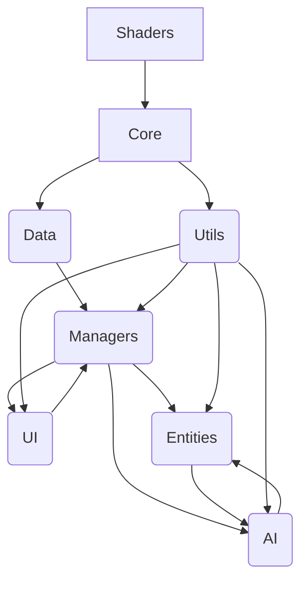

# Vue d'ensemble des Modules de Scripts - GuildForge

**Auteur :** IA Manus
**Date :** 05 octobre 2025
**Version :** 1.0
**Tags :** [scripts, architecture, Godot, modularité]

## Introduction

Ce document fournit une vue d'ensemble de haut niveau de l'organisation des scripts dans le projet GuildForge. Il décrit la structure des répertoires des scripts, le rôle et les responsabilités de chaque module, ainsi que les interactions clés entre eux. L'objectif est de faciliter la compréhension de la base de code, d'améliorer la maintenabilité et de guider les développeurs dans l'ajout de nouvelles fonctionnalités ou la modification de celles existantes, en particulier dans le contexte de l'intégration de code généré par l'IA. Pour des détails sur l'implémentation des systèmes de jeu et l'architecture du code Godot, veuillez consulter [Structure du Projet Godot](./structure_projet_godot.md) et [Principes de Design Logiciel](./principes_design_logiciel.md).

## 1. Structure des Répertoires des Scripts

La structure des répertoires des scripts est conçue pour refléter la séparation des préoccupations et la modularité de l'architecture logicielle du jeu. Tous les scripts GDScript (et potentiellement C#) sont organisés sous le dossier `res://guildforge/scripts/` du projet Godot.

```
guildforge/scripts/
├── core/                               # Scripts fondamentaux du moteur de jeu (extensions, utilitaires génériques)
├── definitions/                        # Scripts liés aux définitions de données (Resources)
├── game_logic/                         # Logique de jeu principale
├── utils/                              # Fonctions utilitaires génériques
└── shaders/                            # Shaders personnalisés
```

## 2. Rôles et Responsabilités des Modules

Chaque répertoire sous `Scripts/` abrite des scripts ayant des responsabilités spécifiques, contribuant à la modularité et à la clarté du projet.

### 2.1. `Core/`

Ce module contient les scripts fondamentaux et les utilitaires génériques qui étendent les fonctionnalités de base de Godot Engine ou fournissent des services transversaux au jeu. Il peut inclure des classes de base personnalisées, des extensions de nœuds Godot, ou des utilitaires qui ne rentrent pas dans une catégorie de gameplay spécifique.

*   **Responsabilités :** Fournir des fondations techniques, des utilitaires de bas niveau, et des extensions du moteur.
*   **Exemples :** `CustomNode2D.gd`, `GlobalSignals.gd`, `MathUtils.gd`.

### 2.2. `Definitions/`

Ce module est dédié aux classes de données qui représentent les définitions du jeu, telles que les Resources de Godot. Il ne contient pas de logique de jeu active, mais plutôt des modèles de données pour les définitions.

*   **Responsabilités :** Définir la structure des données du jeu, gérer la sérialisation/désérialisation des Resources.
*   **Exemples :** `DefBase.gd`, `ColonDef.gd`, `BuildingDef.gd` (Ces fichiers devraient être dans `guildforge/scripts/definitions/` ou `guildforge/scripts/data_models/` selon la structure réelle des dossiers.)`

### 2.3. `Managers/`

Les scripts de ce module sont des gestionnaires de systèmes centraux qui orchestrent des aspects majeurs du gameplay. Ils agissent comme des points d'entrée pour interagir avec des systèmes complexes et maintiennent l'état global de ces systèmes.

*   **Responsabilités :** Gérer des systèmes de jeu complexes, coordonner les interactions entre différentes entités, maintenir l'état global du jeu.
*   **Exemples :** `ColonManager.gd` (gestion des colons), `BuildManager.gd` (gestion de la construction), `EventManager.gd` (gestion des événements), `ResourceManager.gd` (gestion des ressources).

### 2.4. `UI/`

Ce module contient tous les scripts liés à l'interface utilisateur (UI) et à l'expérience utilisateur (UX). Il gère l'affichage des menus, des HUD, des fenêtres contextuelles et les interactions du joueur avec l'interface.

*   **Responsabilités :** Afficher l'interface utilisateur, gérer les entrées utilisateur via l'UI, mettre à jour l'affichage en fonction de l'état du jeu.
*   **Exemples :** `UIManager.gd`, `MainMenu.gd`, `InventoryPanel.gd`, `ColonInfoPanel.gd`.

### 2.5. `Entities/`

Ce module regroupe les classes de base et les scripts spécifiques pour les entités de jeu individuelles, telles que les colons, les bâtiments, les objets, les créatures, etc. Ces scripts encapsulent le comportement et les propriétés propres à chaque type d'entité.

*   **Responsabilités :** Définir le comportement et les propriétés des entités de jeu individuelles.
*   **Exemples :** `Colon.gd`, `Building.gd`, `Item.gd`, `Creature.gd`.

### 2.6. `AI/`

Ce module est dédié aux scripts d'intelligence artificielle, gérant le comportement des colons, des ennemis et d'autres entités non-joueurs. Il peut inclure des systèmes de prise de décision, de pathfinding, d'arbres de comportement ou de planification.

*   **Responsabilités :** Orchestrer le comportement des entités non-joueurs, prendre des décisions, gérer le pathfinding.
*   **Exemples :** `AIController.gd`, `ColonAI.gd`, `EnemyAI.gd`, `BehaviorTree.gd`.

### 2.7. `Utils/`

Ce module contient des fonctions et des classes utilitaires génériques qui peuvent être utilisées à travers tout le projet mais qui n'appartiennent pas spécifiquement à un autre module. Cela inclut des helpers, des extensions de fonctionnalités Godot, ou des algorithmes réutilisables.

*   **Responsabilités :** Fournir des fonctions d'aide et des utilitaires réutilisables.
*   **Exemples :** `ArrayUtils.gd`, `StringUtils.gd`, `SaveLoadUtils.gd`.

### 2.8. `Shaders/`

Ce module contient les fichiers de shaders personnalisés (`.gdshader`) utilisés pour les effets visuels, le rendu graphique ou l'optimisation. Bien que techniquement pas des scripts GDScript, ils sont étroitement liés au code de rendu.

*   **Responsabilités :** Définir les effets visuels et les traitements graphiques.
*   **Exemples :** `CustomLighting.gdshader`, `PostProcessEffect.gdshader`.

## 3. Interactions Clés entre les Modules

Les modules interagissent de manière structurée pour assurer le bon fonctionnement du jeu. Voici quelques exemples d'interactions typiques :

*   **`Managers` et `Entities` :** Les `Managers` (par exemple, `ColonManager`) créent, gèrent et mettent à jour les instances d' `Entities` (par exemple, `Colon`). Les `Entities` signalent leurs changements d'état aux `Managers`.
*   **`Managers` et `Data` :** Les `Managers` accèdent aux `Defs` via le `DataManager` (qui fait partie du module `Data`) pour obtenir les propriétés et les comportements des entités et des systèmes.
*   **`UI` et `Managers` :** Le module `UI` interagit avec les `Managers` pour afficher les informations du jeu et envoyer les commandes du joueur. Les `Managers` notifient l' `UI` des changements d'état.
*   **`AI` et `Entities` :** Les scripts d' `AI` dirigent le comportement des `Entities` (par exemple, `ColonAI` contrôle un `Colon`), en utilisant les informations de l'environnement et les objectifs définis.
*   **`Core` / `Utils` :** Ces modules fournissent des services et des fonctions d'aide qui sont utilisés par tous les autres modules, garantissant la réutilisabilité et la cohérence.

## 4. Intégration du Code Généré par l'IA

Le code généré par l'IA est intégré dans cette structure en respectant les conventions de chaque module. Par exemple, un script d'IA généré sera placé dans `Scripts/AI/`, tandis qu'une nouvelle classe de données pour un `Def` irait dans `Scripts/Data/`. Une validation et un refactoring sont toujours nécessaires pour assurer la conformité et la performance.

## Références

*   [Vue d'ensemble de l'Architecture](./principes_design_logiciel.md)
*   [Vue d'ensemble du Projet GuildForge](../../game_design/README.md)
*   [Guide d'Intégration Godot](../outils_environnement/configuration_godot.md)
*   [Workflow d'Intégration de l'IA Générative](../../gestion_projet/communication_workflow/contributions.md)



